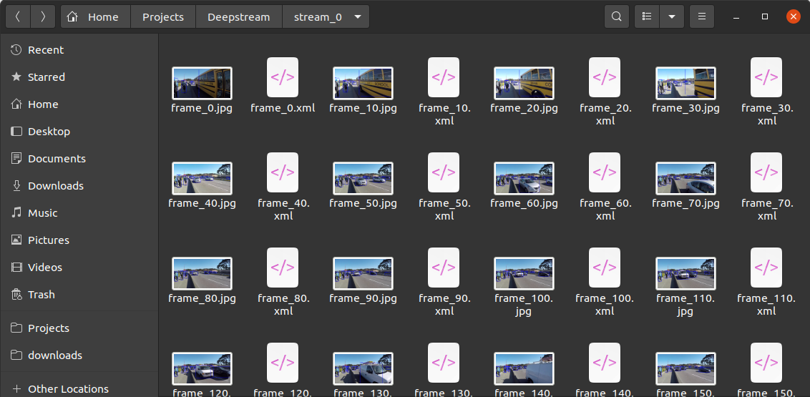

# Deepstream-Auto-Annotation-Tool

## Introduction
This tool is about auto annotating objects in a video stream and making an xml file correnponding to a frame in the video and storing it for training to get more accurate predictions.


## Here's how it looks
<p>
    
</p>

## How to use
### 1. Install [Docker](https://docs.docker.com/get-docker/)


### 2. Set Deepstream in your Docker
```sh
docker pull nvcr.io/nvidia/deepstream:5.1-21.02-devel
xhost +
docker run --gpus all -it --rm -v /tmp/.X11-unix:/tmp/.X11-unix -e DISPLAY=$DISPLAY -w /opt/nvidia/deepstream/deepstream-5.1 nvcr.io/nvidia/deepstream:5.1-21.02-devel

apt-get update
apt-get install -y libgstreamer1.0-dev libgstreamer-plugins-base1.0-dev
apt-get install -y gstreamer-1.0
apt-get install -y python-gi-dev
cd /opt/nvidia/deepstream/deepstream-5.1/sources/
git clone https://github.com/NVIDIA-AI-IOT/deepstream_python_apps.git
cd deepstream_python_apps/apps/deepstream-test3/
python3 deepstream_test_3.py file:///opt/nvidia/deepstream/deepstream-5.1/samples/streams/sample_1080p_h264.mp4
```
If above all commands are executing, then your deepstream docker image is set correctly.


### 3. Setting up the code
Copy the `deepstream_imgdata_with_bboxes.py` or `deepstream_imgdata_without_bbox.py` in your `deepstream-imagedata-multistream` folder.

`deepstream_imgdata_with_bboxes.py` : outputs images which have bounding boxes on them with the XML file for that corresponding image. 

`deepstream_imgdata_without_bbox.py` : outputs images which <b>DOES NOT</b> have bounding boxes on them with the XML file for that corresponding image.

`cd` to `deepstream-imagedata-multistream` folder will be present on this path `/opt/nvidia/deepstream/deepstream-5.1/sources/deepstream_python_apps/apps/deepstream-imagedata-multistream/` if you follow step 2 without errors.


### 4. Run this command
This command runs `deepstream_imgdata_without_bbox.py` and will make a folder named `deepstream_imgdata_without_bbox/stream_0` which will contain images with its xml just like shown below. 
```sh
python3 deepstream_imgdata_without_bbox.py file:///opt/nvidia/deepstream/deepstream-5.1/samples/streams/sample_1080p_h264.mp4 deepstream_imgdata_without_bbox
```

<p>
    
</p>


**NOTE**: This img and xml file are used to make a larger dataset which will be further trained to increase accuracy and reduce time in manual annotating the objects in the dataset. 